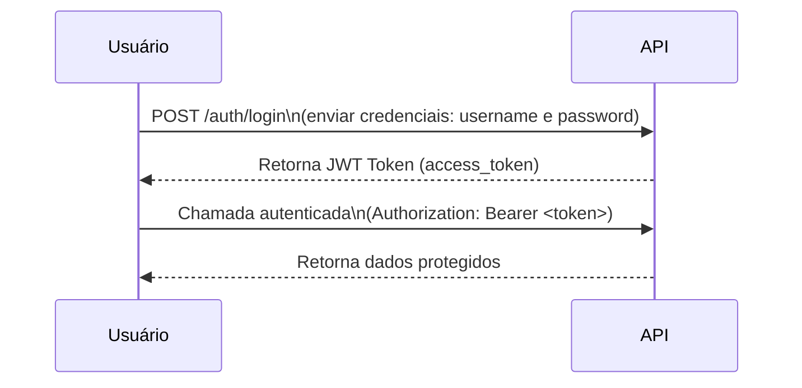
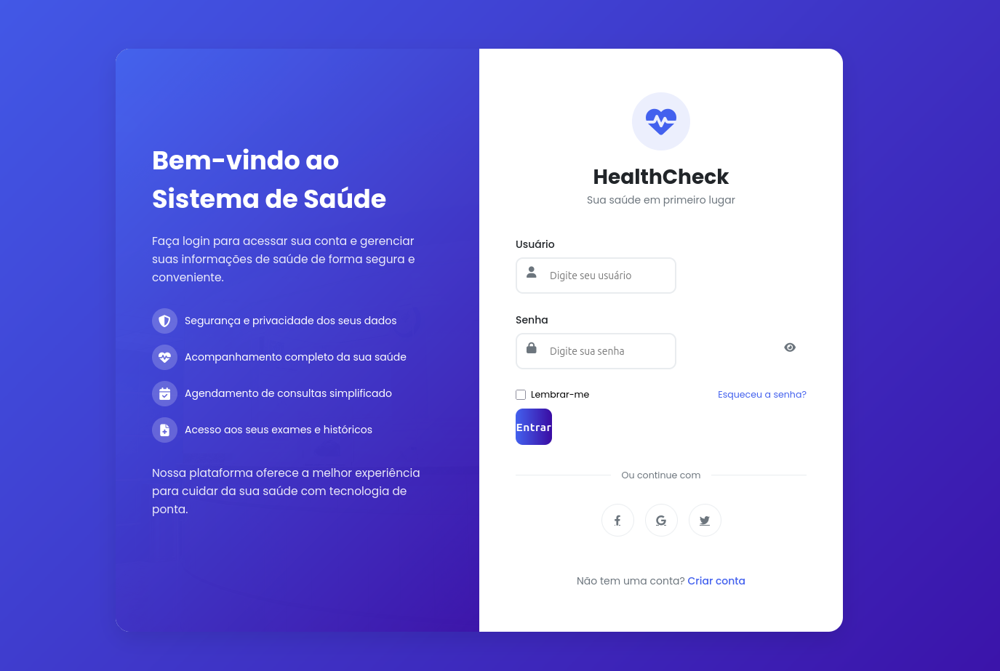
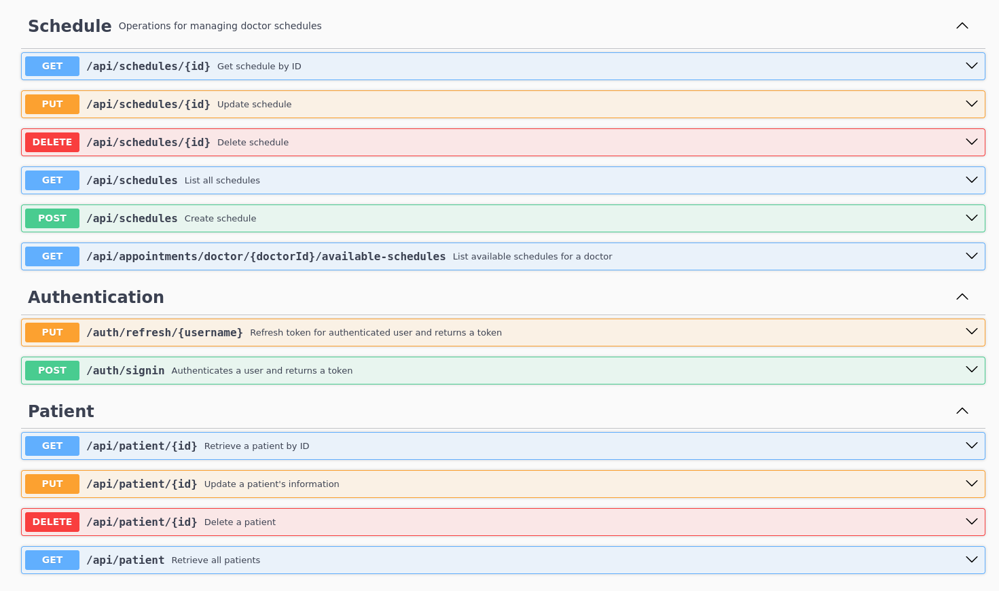
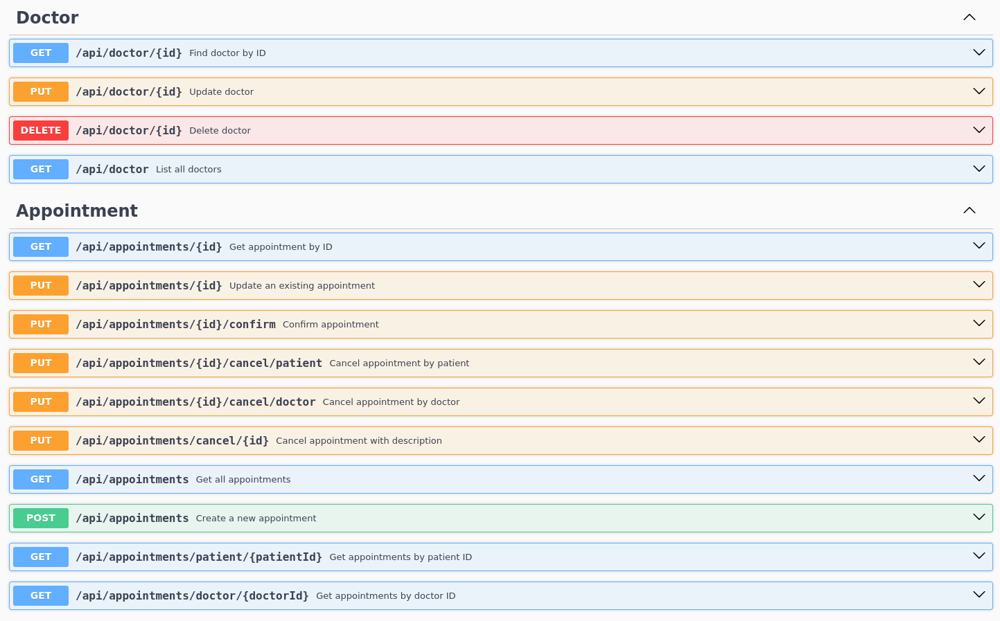

# 🏥 Health Check - API de Agendamento Médico

[](https://www.oracle.com/java/)
[](https://spring.io/projects/spring-boot)
[](LICENSE)
[](README.md)

---
## 📖 Descrição
A **HealthCheck API** é uma API REST construída com **Java 21** com **Spring Boot**, para gerenciamento de agendamento de consultas médicas. O objetivo é proporcionar uma experiência real de desenvolvimento profissional, aplicando as melhores práticas de backend modernas. A API oferece recursos de autenticação, cadastro de médicos, pacientes e controle de consultas.

|                   🚀 Tecnologias                    |      🚀 + Padrões Utilizados                  |
|-----------------------------------------------------|-----------------------------------------------|
| ✅ **Linguagem: Java 21+**                          | ✅ **Lombok**                                 |
| ✅ **Framework: Spring Boot 3.5.x**                 | ✅ **Bean Validation**                        |
| ✅ **Camadas: `Controller → Service → Repository`** | ✅ **Actuador**                               |
| ✅ **Spring Security (JWT)**                        | ✅ **Cors Configuration**                     |
| ✅ **Spring Data JPA**                              | ✅ **Postman para testes**                    |
| ✅ **MySQL (com Docker)**                           | ✅ **Padronização de logs com SLF4J**         |
| ✅ **Docker + Docker Compose**                      | ✅ **Tratamento de exceções customizadas**    |
| ✅ **DTO com `record`**                             | ✅ **Thymeleaf**                              |
| ✅ **MapStruct para conversões**                    | ✅ **Swagger SpringDoc OpenAPI + Swagger UI** |

---


---

## 🔐 Autenticação e Autorização

O projeto utiliza autenticação via JWT Token, Criptografia com PBKDF2WithHmacSHA256 e Role-Based Access Control (RBAC) 
com as seguintes roles:

    ROLE_DOCTOR - Médicos
    ROLE_PATIENT - Pacientes
    ROLE_ADMIN - Administrador do Sistema

Exemplo de fluxo:


---

---
## 📂 Estrutura do Projeto

```bash
src/
 ├── main/
 │    ├── java/
 │    │     └── com.santt4na.healthcheck/
 │    │           ├── controller/            (Endpoints da aplicação)
 │    │           │     ├── docs/            (Documentação das rotas)
 │    │           │     └── views/           (Controllers de páginas Thymeleaf)
 │    │           ├── entity/                (Entidades JPA no sistema)
 │    │           │     └── security/        (Entidades de autenticação e permissões)
 │    │           ├── dto/                   (Objetos de transferência de dados - DTOs)
 │    │           │     ├── appointmentsDTO/ (DTOs de agendamento de consultas)
 │    │           │     ├── doctorDTO/       (DTOs de médicos)
 │    │           │     ├── patientDTO/      (DTOs de pacientes)
 │    │           │     ├── scheduleDTO/     (DTOs de horários disponíveis)
 │    │           │     └── securityDTO/     (DTOs de autenticação e segurança)
 │    │           ├── enum/                  (Enums e tipos fixos no sistema)
 │    │           ├── health/                (Actuador com o monitoramento)
 │    │           ├── mapper/                (Conversão entre Entidades e DTOs via MapStruct)
 │    │           ├── exceptions/            (Exceções customizadas da aplicação)
 │    │           │     └── handler/         (Tratamento global de exceções)
 │    │           ├── repository/            (Repositórios de acesso a dados - JPA)
 │    │           ├── service/               (Camada de regras de negócio - Services)
 │    │           │     ├── impl/            (Implementações concretas dos serviços)
 │    │           │     └── security/        (Serviços relacionados à segurança/autenticação)
 │    │           ├── config/                (Configurações gerais no projeto)
 │    │           └── security/              (Configurações específicas de segurança)
 │    │                 └── jwt/             (Geração e validação de tokens JWT)
 │    └── resources/
 │          ├── application.yml              (Configurações externas da aplicação)
 │          ├── logback-spring.xml           (Configuração de logs SLF4J)
 │          └── db/migration/                (Scripts de versionamento Flyway)
 └── test/                                   (Testes unitários e de integração)
```
## 📚 Documentação da API

A documentação completa da API está disponível no Swagger UI:
➡️ [http://localhost:8080/swagger-ui/index.html](http://localhost:8080/swagger-ui/index.html)
- Configurado via SpringDoc (`springdoc-openapi-ui`)
- Versão da API: v1.0.0
- Todos os endpoints documentados




---

## 🏗️ Melhorias Futuras

- Validação dos CRM dos Medicos
- Validação dos Planos de Saude dos Pacientes
- Notificações por e-mail
- Interface administrativa com Thymeleaf
- Implementar OAuth 2.0 Authentication

---

## 🪪 Licença
**Criado Por Jorge Santana (Santt4na) By Intellij IDEA -** 
**Este projeto está licenciado sob a [MIT License](LICENSE).**
